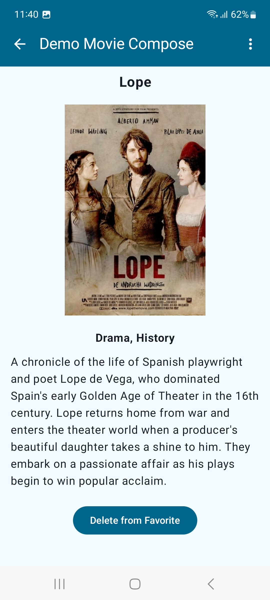

# DemoMovieCompose

**Screenshots:**
|           |  |  |
| ------------------------------------------------ | ----------------------------------------------- | --------------------------------------------- |
|  |   |   |

**Technology Stack:**
- Kotlin Programming Language
- Clean Architecture
- MVVM Architecture Pattern
- Hilt Dependency Injection
- Jetpack Compose
- ViewModel
- ROOM Database
- Retrofit REST + OkHttp
- Coroutine
- Flow
- GSON Serialization
- Coil
- Gradle build flavors
- BuildSrc + Kotlin DSL
- Proguard
- Git

**To run the project in DEBUG MODE:**

Get the access token (not the api key) from [api.themoviedb.org](https://api.themoviedb.org/).

Create file namely “key.properties” in the root project with following contents:

storePassword=<your_keystore_password>  
keyPassword=<your_key_password>  
keyAlias=<your_key_alias>  
storeFile=<path_to_keystore_file>  
accessToken=<your_access_token>  

once you have created it, open the project with Android Studio, build the project and run the project.
